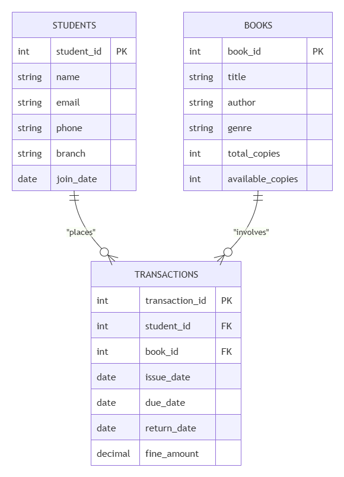
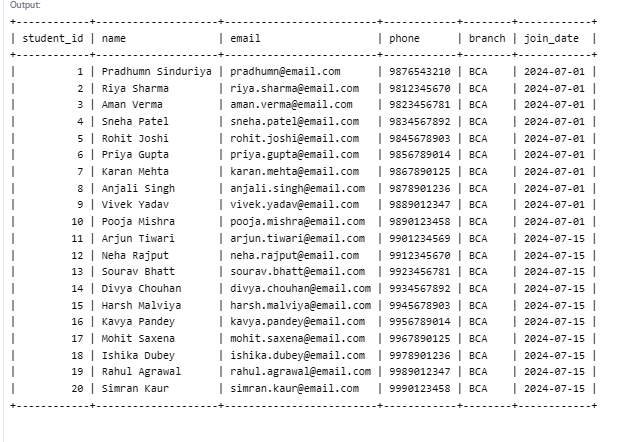
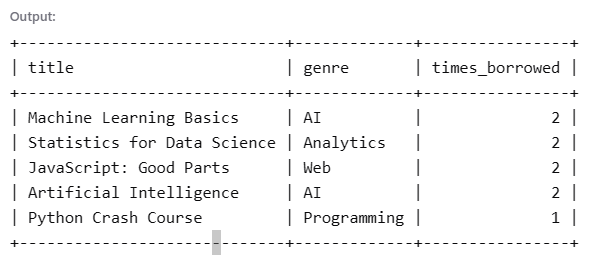
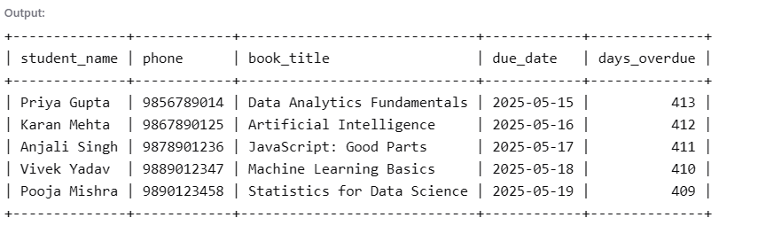
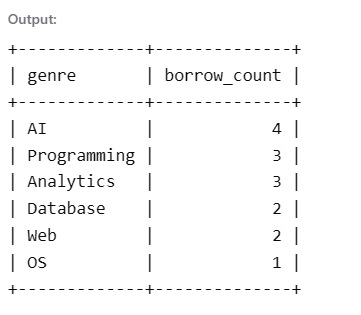
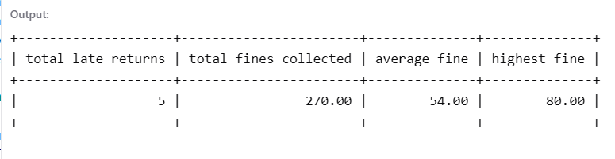

# 📚 Library Management System — SQL

A relational database system built with MySQL to manage library 
operations including book issuance, returns, overdue tracking, 
and borrowing analytics.

## Features
- Normalized schema with 3 tables and foreign key constraints
- Tracks book issuance, returns, and overdue status
- Calculates fines based on return date
- Analytical queries for borrowing trends and genre popularity

## Tech Stack
- MySQL 8.0
- MySQL Workbench
- OneCompiler (online SQL editor)

## Database Schema

### ER Diagram

### Tables
- `students` — stores student records (20 sample records)
- `books` — stores book inventory with available copies (20 books)
- `transactions` — records all issue/return activity with fine tracking (15 records)

## Query Results

### All Students

### Most Borrowed Books

### Overdue Books

### Genre Popularity

### Fine Collection Summary

## Project Structure

library-management-sql/
├── schema/
│   └── create_tables.sql        # Database and table creation
├── data/
│   └── sample_data.sql          # Sample records
├── queries/
│   ├── basic_queries.sql        # Simple SELECT queries
│   ├── analytical_queries.sql   # JOINs, GROUP BY, aggregates
│   └── reports.sql              # Management reports
└── screenshots/                 # Query results and ER diagram

## How to Run
1. Install MySQL and MySQL Workbench
   OR use onecompiler.com/mysql (no install needed)
2. Run `schema/create_tables.sql` first
3. Run `data/sample_data.sql` to insert records
4. Open any file in `queries/` folder and run to see results

## Key SQL Concepts Used
- Primary Keys and Foreign Keys
- NOT NULL and UNIQUE constraints
- INNER JOIN across multiple tables
- GROUP BY with COUNT and SUM aggregates
- DATEDIFF for date calculations
- Subqueries and ORDER BY

## Author
**Pradhumn Sinduriya**  
BCA Student — IPS Academy, Indore (DAVV)  
[LinkedIn](https://linkedin.com/in/pradhumnsinduriya12071) | [GitHub](https://github.com/pradhumn-sinduriya)